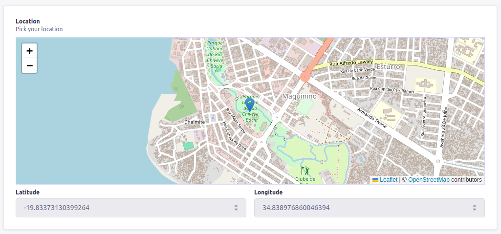

# Strapi Open Street Maps



## Overview

The Strapi Open Street Maps plugin enhances your Strapi content-types by providing a custom field for seamlessly integrating Open Street Maps. This feature empowers users to effortlessly select and retrieve location data within their content.

## Example API Response

Upon implementing the `open-street-maps` custom field in a Strapi content-type, the API response takes the following structure:

```json
{
  "data": {
    "id": 1,
    "attributes": {
      "createdAt": "2023-12-02T11:28:20.689Z",
      "updatedAt": "2023-12-02T11:28:39.133Z",
      "location": {
        "lat": -19.834256108664132,
        "lng": 34.8413372039795
      },
      "title": "Hello"
    }
  },
  "meta": {}
}
```

## Requirements

Ensure your Strapi version is v4 or higher to leverage the full capabilities of the Strapi Open Street Maps plugin.

## Installation

To integrate the Strapi Open Street Maps plugin into your project, follow these steps:

1. Install the strapi-open-street-maps package via npm at the root of your Strapi project.
   ```bash
   npm install @isneezy/strapi-open-street-maps
   ```
2. After installing the package, restart your Strapi app. Open Street Maps should now be listed among your plugins.

## Strapi Configuration (required)

For proper functioning of Open Street Maps, adjust the strapi::security middleware within the `./config/middlewares.js` file:

```diff
module.exports = [
-  "strapi::security",
+  {
+    name: "strapi::security",
+    config: {
+      contentSecurityPolicy: {
+        useDefaults: true,
+        directives: {
+          "img-src": ["https://tile.openstreetmap.org"],
+        },
+      },
+    },
+  },
];
```

These configuration changes ensure that Open Street Maps assets are loaded correctly in your Strapi project.
